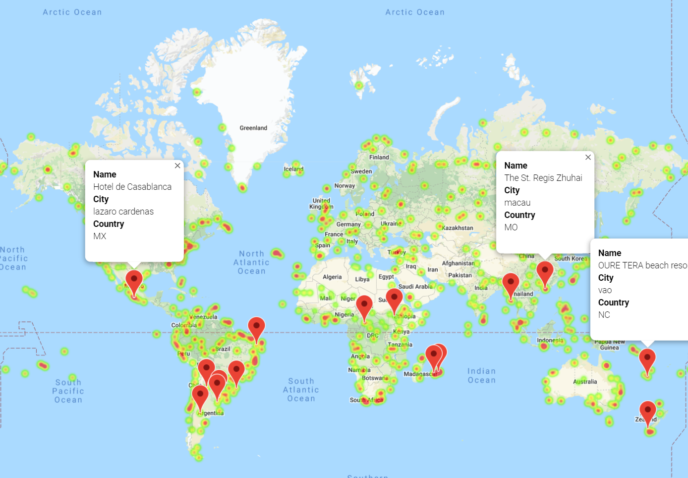

## Background

Tools used: Python API Interactions, Jupyter notebook, Jupyter-gmaps, Matplotlib, Numpy, scipy.stats, Pandas

Make use of Python requests, APIs, and JSON traversals to help prove the answer of a fundamental question: "What's the weather like as we approach the equator?"

## Part I - WeatherPy

Created a Python script to visualize the weather of 500+ cities across the world of varying distance from the equator. Utilized a [simple Python library](https://pypi.python.org/pypi/citipy), and the [OpenWeatherMap API](https://openweathermap.org/api).

Created a series of scatter plots to showcase the following relationships:

* Temperature (F) vs. Latitude
* Humidity (%) vs. Latitude
* Cloudiness (%) vs. Latitude
* Wind Speed (mph) vs. Latitude

Ran a simple linear regression on each relationship seperated by the Northern Hemisphere (greater than or equal to 0 degrees latitude) and the Southern Hemisphere (less than 0 degrees latitude):

* Northern Hemisphere - Temperature (F) vs. Latitude
* Southern Hemisphere - Temperature (F) vs. Latitude
* Northern Hemisphere - Humidity (%) vs. Latitude
* Southern Hemisphere - Humidity (%) vs. Latitude
* Northern Hemisphere - Cloudiness (%) vs. Latitude
* Southern Hemisphere - Cloudiness (%) vs. Latitude
* Northern Hemisphere - Wind Speed (mph) vs. Latitude
* Southern Hemisphere - Wind Speed (mph) vs. Latitude

### Part II - VacationPy

Use of jupyter-gmaps and the Google Places API to help plan furture vacations based on weather.
  **Note:** if there is any trouble displaying the maps, try running `jupyter nbextension enable --py gmaps` in the environment and retry.

Steps taken:

* Created a heat map that displays the humidity for every city from Part I.

  

* Narrowed down the DataFrame to find the ideal weather conditions:

  * A max temperature lower than 80 degrees but higher than 70.

  * Wind speed less than 10 mph.

  * Zero cloudiness.

* Use of Google Places API to find the first hotel for each city located within 5000 meters of the city's coordinates.

* Included the hotels on top of the humidity heatmap with each pin containing the **Hotel Name**, **City**, and **Country**.

  

* Final plots are located in the output_data folder.

